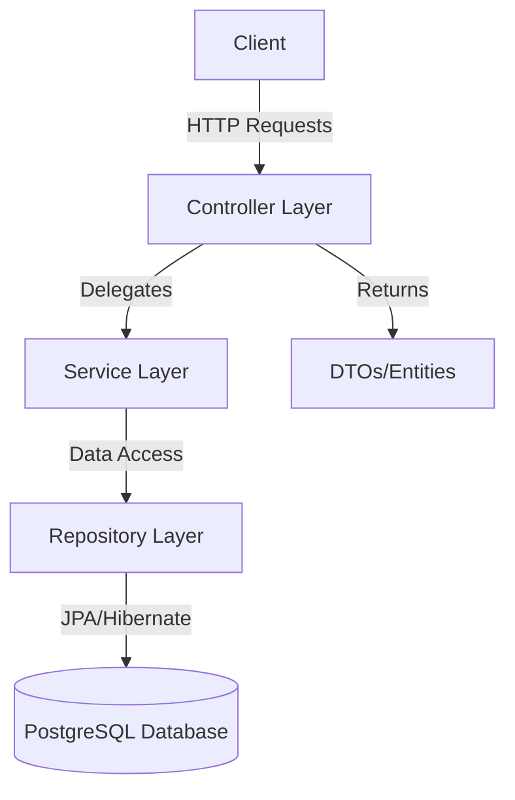
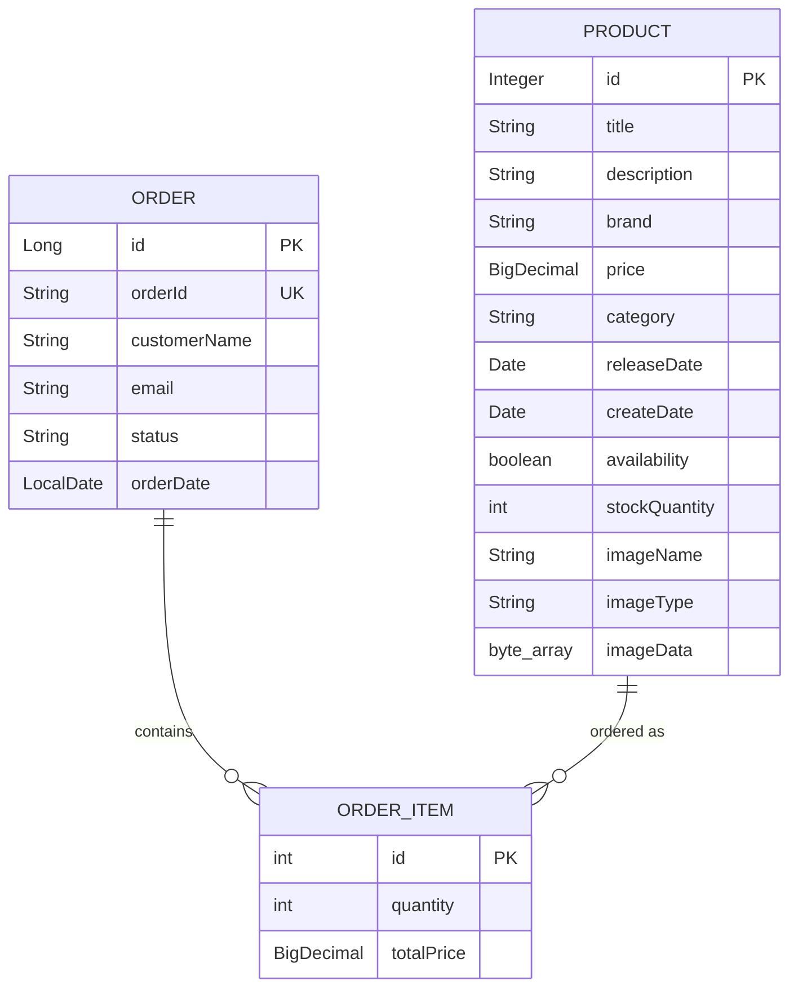

# Spring Boot E-Commerce Application - Project Analysis

## 📋 Project Overview

This is a **RESTful backend application** for an e-commerce platform built with **Spring Boot 4.0.0** and **Java 21**. The application manages products and orders with image upload capabilities, using **PostgreSQL** as the database.

---

## 🏗️ Architecture Pattern

The application follows the **Layered/N-Tier Architecture** pattern with clear separation of concerns:



**Layers:**
1. **Controller Layer** - REST endpoints, request/response handling
2. **Service Layer** - Business logic implementation
3. **Repository Layer** - Data access via JPA
4. **Model Layer** - Entities and DTOs

---

## 🔧 Technology Stack

### Core Dependencies
- **Spring Boot**: `4.0.0`
- **Java**: `21`
- **Spring Web MVC**: RESTful web services
- **Spring Data JPA**: Database operations
- **PostgreSQL**: Relational database
- **Lombok**: `1.18.42` - Reduces boilerplate code
- **Jackson**: JSON serialization (via `com.fasterxml..jackson`)

### Build Tool
- **Maven** with compiler plugin version `3.13.0`

---

## ⚙️ Configuration

### Database Configuration ([application.properties](file:///c:/Learning_Path/learn_spring_boot/REST-Project/e-commerce-webapp/SpringEcom/src/main/resources/application.properties))

```properties
# Database
spring.datasource.url=jdbc:postgresql://localhost:5432/e_commerce
spring.datasource.username=postgres
spring.datasource.password=admin

# JPA/Hibernate
spring.jpa.hibernate.ddl-auto=update
spring.jpa.show-sql=true
spring.jpa.properties.hibernate.format_sql=true
spring.datasource.hikari.auto-commit=false

# Server
server.port=8080
```

**Key Points:**
- Uses PostgreSQL database named `e_commerce` on localhost
- Hibernate auto-updates schema on application startup
- SQL queries are logged and formatted for debugging
- Hikari connection pool with auto-commit disabled
- Runs on port 8080

---

## 📊 Data Model

### Entity Relationships



### 1. Product Entity ([Product.java](file:///c:/Learning_Path/learn_spring_boot/REST-Project/e-commerce-webapp/SpringEcom/src/main/java/com/edu/SpringEcom/model/Product.java))

**Purpose**: Represents products in the catalog

**Key Features:**
- Stores product images as byte arrays (`@Lob` annotation)
- Date formatting with Jackson (`@JsonFormat` - "dd-MM-yyyy")
- Uses `BigDecimal` for price (financial precision)
- Manual getters/setters despite Lombok (possibly for debugging)

**Fields:**
- `id` (Integer) - Auto-generated primary key
- `title`, `description`, `brand`, `category` - Product details
- `price` (BigDecimal) - Product price
- `releaseDate`, `createDate` - Temporal data
- `availability` (boolean) - Stock status
- `stockQuantity` (int) - Available inventory
- `imageName`, `imageType`, `imageData` - Image storage

### 2. Order Entity ([Order.java](file:///c:/Learning_Path/learn_spring_boot/REST-Project/e-commerce-webapp/SpringEcom/src/main/java/com/edu/SpringEcom/model/Order.java))

**Purpose**: Represents customer orders

**Key Features:**
- Table name: `orders` (reserved keyword workaround)
- One-to-Many relationship with OrderItems
- Unique order ID for tracking
- `@Builder` annotation commented out

**Fields:**
- `id` (Long) - Auto-generated primary key
- `orderId` (String) - Unique order identifier (UUID-based)
- `customerName`, `email` - Customer details
- `status` - Order status (e.g., "PLACED")
- `orderDate` (LocalDate) - Order timestamp
- `orderItems` - List of order items (cascade operations)

### 3. OrderItem Entity ([OrderItem.java](file:///c:/Learning_Path/learn_spring_boot/REST-Project/e-commerce-webapp/SpringEcom/src/main/java/com/edu/SpringEcom/model/OrderItem.java))

**Purpose**: Junction entity linking orders and products

**Key Features:**
- Uses `@Builder` pattern for construction
- LAZY fetching for Order relationship
- Stores calculated total price

**Relationships:**
- `@ManyToOne` with Product
- `@ManyToOne(fetch = FetchType.LAZY)` with Order

---

## 🔄 DTOs (Data Transfer Objects)

### Request DTOs

#### [OrderRequest](file:///c:/Learning_Path/learn_spring_boot/REST-Project/e-commerce-webapp/SpringEcom/src/main/java/com/edu/SpringEcom/model/dto/OrderRequest.java)
```java
public record OrderRequest(
    String customerName,
    String email,
    List<OrderItemRequest> items
) {}
```

#### [OrderItemRequest](file:///c:/Learning_Path/learn_spring_boot/REST-Project/e-commerce-webapp/SpringEcom/src/main/java/com/edu/SpringEcom/model/dto/OrderItemRequest.java)
```java
public record OrderItemRequest(
    int productId,
    int quantity
) { }
```

### Response DTOs

#### [OrderResponse](file:///c:/Learning_Path/learn_spring_boot/REST-Project/e-commerce-webapp/SpringEcom/src/main/java/com/edu/SpringEcom/model/dto/OrderResponse.java)
```java
public record OrderResponse(
    String orderId,
    String customerName,
    String email,
    String status,
    LocalDate orderDate,
    List<OrderItemResponse> items
) { }
```

#### [OrderItemResponse](file:///c:/Learning_Path/learn_spring_boot/REST-Project/e-commerce-webapp/SpringEcom/src/main/java/com/edu/SpringEcom/model/dto/OrderItemResponse.java)
```java
public record OrderItemResponse(
    String productName,
    int quantity,
    BigDecimal totalPrice
) { }
```

**Note**: Uses Java 17+ `record` types for immutable DTOs

---

## 💾 Repository Layer

### [ProductRepo](file:///c:/Learning_Path/learn_spring_boot/REST-Project/e-commerce-webapp/SpringEcom/src/main/java/com/edu/SpringEcom/repo/ProductRepo.java)

```java
@Repository
public interface ProductRepo extends JpaRepository<Product, Integer> {
    @Query("SELECT p FROM Product p WHERE " +
           "LOWER(p.title) LIKE LOWER(CONCAT('%', :keyword, '%')) OR " +
           "LOWER(p.description) LIKE LOWER(CONCAT('%', :keyword, '%')) OR " +
           "LOWER(p.brand) LIKE LOWER(CONCAT('%', :keyword, '%')) OR " +
           "LOWER(p.category) LIKE LOWER(CONCAT('%', :keyword, '%'))")
    List<Product> searchProducts(String keyword);
}
```

**Features:**
- Extends `JpaRepository<Product, Integer>`
- Custom JPQL query for case-insensitive search across multiple fields

### [OrderRepo](file:///c:/Learning_Path/learn_spring_boot/REST-Project/e-commerce-webapp/SpringEcom/src/main/java/com/edu/SpringEcom/repo/OrderRepo.java)

```java
@Repository
public interface OrderRepo extends JpaRepository<Order, Integer> {
    Optional<Order> findByOrderId(String orderId);
}
```

**Features:**
- Extends `JpaRepository<Order, Integer>`
- Custom finder method for order lookup by orderId

---

## 🎯 Service Layer

### [ProductService](file:///c:/Learning_Path/learn_spring_boot/REST-Project/e-commerce-webapp/SpringEcom/src/main/java/com/edu/SpringEcom/service/ProductService.java)

**Business Logic:**

| Method | Description |
|--------|-------------|
| `getAllProducts()` | Retrieves all products |
| `getProductById(int id)` | Finds product by ID, returns null if not found |
| `addOrUpdateProduct(Product, MultipartFile)` | Saves product with image data |
| `deleteProduct(int id)` | Deletes product by ID |
| `searchProducts(String keyword)` | Searches products using repository query |

**Image Handling:**
- Extracts `originalFilename`, `contentType`, and `bytes` from MultipartFile
- Stores image data directly in database as byte array

### [OrderService](file:///c:/Learning_Path/learn_spring_boot/REST-Project/e-commerce-webapp/SpringEcom/src/main/java/com/edu/SpringEcom/service/OrderService.java)

**Business Logic:**

#### `placeOrder(OrderRequest request)`
1. Creates new Order with UUID-based orderId (8 characters)
2. Sets status to "PLACED" and orderDate to current date
3. For each order item:
   - Fetches product from database
   - Decrements stock quantity
   - Builds OrderItem with calculated total price
   - Links OrderItem to Order
4. Saves order with cascade (saves all OrderItems)
5. Maps to OrderResponse DTO

> ⚠️ **Potential Bug**: Line 52 has `order.setOrderItems(orderItems);` inside the loop, but `orderItems` list is never populated. This might cause issues.

#### `getAllOrderResponses()`
- Retrieves all orders from database
- Converts each Order entity to OrderResponse DTO
- Maps nested OrderItems to OrderItemResponse DTOs

---

## 🌐 Controller Layer

### [ProductController](file:///c:/Learning_Path/learn_spring_boot/REST-Project/e-commerce-webapp/SpringEcom/src/main/java/com/edu/SpringEcom/controller/ProductController.java)

**Base Path**: `/api`

**CORS**: Enabled via `@CrossOrigin`

### API Endpoints

| Method | Endpoint | Description | Request/Response |
|--------|----------|-------------|------------------|
| GET | `/api/products` | Get all products | Returns `List<Product>` |
| GET | `/api/product/{id}` | Get product by ID | Returns `Product` or 404 |
| POST | `/api/product` | Create product | `@RequestPart Product`, `@RequestPart MultipartFile` |
| GET | `/api/product/{productId}/image` | Get product image | Returns `byte[]` |
| PUT | `/api/product/{id}` | Update product | `@RequestPart Product`, `@RequestPart MultipartFile` |
| DELETE | `/api/product/{id}` | Delete product | Returns "Delete" or 404 |
| GET | `/api/products/search?keyword=` | Search products | Returns `List<Product>` |

**Notes:**
- Uses `@RequestPart` for multipart form data (product + image)
- Image endpoint returns raw byte array
- Returns appropriate HTTP status codes

### [OrderController](file:///c:/Learning_Path/learn_spring_boot/REST-Project/e-commerce-webapp/SpringEcom/src/main/java/com/edu/SpringEcom/controller/OrderController.java)

**Base Path**: `/api`

**CORS**: Enabled via `@CrossOrigin`

### API Endpoints

| Method | Endpoint | Description | Request/Response |
|--------|----------|-------------|------------------|
| POST | `/api/orders/place` | Place new order | `@RequestBody OrderRequest` → `OrderResponse` |
| GET | `/api/orders` | Get all orders | Returns `List<OrderResponse>` |

**Notes:**
- Uses `@RequestBody` for JSON payloads
- Returns DTOs instead of entities (good practice)

---

## 🔍 Key Observations & Potential Issues

### ✅ Strengths
1. **Clean Architecture** - Clear separation of concerns
2. **DTO Pattern** - Uses DTOs for API responses (avoids exposing entities)
3. **Modern Java** - Uses records, Java 21 features
4. **Image Storage** - Built-in image handling with LOB storage
5. **Search Functionality** - Case-insensitive multi-field search
6. **Proper Annotations** - Uses Lombok, Jackson, JPA annotations effectively

### ⚠️ Potential Issues

1. **OrderService Bug** (Line 52 in [OrderService.java](file:///c:/Learning_Path/learn_spring_boot/REST-Project/e-commerce-webapp/SpringEcom/src/main/java/com/edu/SpringEcom/service/OrderService.java#L52))
   - `orderItems` list is declared but never populated with items
   - `order.setOrderItems(orderItems)` is called inside the loop with empty list
   - Should be called outside the loop after all items are added

2. **Missing @Autowired** in OrderService
   - Only `ProductRepo` has `@Autowired`, not `OrderRepo`
   - Might work due to constructor injection, but inconsistent

3. **Auto-commit Disabled**
   - `spring.datasource.hikari.auto-commit=false` requires manual transaction management
   - Ensure `@Transactional` is added where needed

4. **Image Storage in Database**
   - Storing images as BLOBs can cause performance issues with large datasets
   - Consider using file storage or CDN for production

5. **No Validation**
   - No `@Valid` or validation annotations on DTOs/entities
   - No stock quantity checks before order placement

6. **Error Handling**
   - Generic `RuntimeException` thrown for product not found
   - No global exception handler (`@ControllerAdvice`)

7. **Commented Code**
   - `@Builder` commented in Order.java (line 16)
   - Commented out int id field in Product.java (line 21)

8. **Inconsistent ID Types**
   - `Product`: Integer
   - `Order`: Long
   - `OrderItem`: int (primitive)
   - `OrderRepo`: `JpaRepository<Order, Integer>` but Order.id is Long

---

## 📁 Project Structure

```
SpringEcom/
├── src/main/java/com/edu/SpringEcom/
│   ├── SpringEcomApplication.java          # Main application class
│   ├── controller/
│   │   ├── ProductController.java          # Product REST endpoints
│   │   └── OrderController.java            # Order REST endpoints
│   ├── service/
│   │   ├── ProductService.java             # Product business logic
│   │   └── OrderService.java               # Order business logic
│   ├── repo/
│   │   ├── ProductRepo.java                # Product data access
│   │   └── OrderRepo.java                  # Order data access
│   ├── model/
│   │   ├── Product.java                    # Product entity
│   │   ├── Order.java                      # Order entity
│   │   ├── OrderItem.java                  # OrderItem entity
│   │   └── dto/
│   │       ├── OrderRequest.java           # Order creation DTO
│   │       ├── OrderResponse.java          # Order response DTO
│   │       ├── OrderItemRequest.java       # OrderItem request DTO
│   │       └── OrderItemResponse.java      # OrderItem response DTO
├── src/main/resources/
│   └── application.properties              # Application configuration
└── pom.xml                                 # Maven dependencies
```

---

## 🔄 Typical Request Flow

### Example: Placing an Order

1. **Client** sends POST request to `/api/orders/place` with JSON:
   ```json
   {
     "customerName": "John Doe",
     "email": "john@example.com",
     "items": [
       {"productId": 1, "quantity": 2},
       {"productId": 3, "quantity": 1}
     ]
   }
   ```

2. **OrderController** receives request, deserializes to `OrderRequest`

3. **OrderService.placeOrder()**:
   - Creates Order entity with UUID orderId
   - For each item: fetches Product, updates stock, creates OrderItem
   - Saves Order (cascades to OrderItems)
   - Maps to OrderResponse

4. **Controller** returns OrderResponse with HTTP 201 CREATED

---

## 📝 Summary

This is a **well-structured Spring Boot REST API** for e-commerce with:
- ✅ Product management (CRUD + search + image upload)
- ✅ Order processing with inventory management
- ✅ Clean layered architecture
- ✅ PostgreSQL persistence with JPA/Hibernate

**Recommended Next Steps:**
1. Fix the OrderService bug (orderItems list population)
2. Add input validation (`@Valid`, custom validators)
3. Implement global exception handling
4. Add `@Transactional` annotations
5. Consider moving image storage to filesystem/cloud
6. Add unit and integration tests
7. Fix ID type inconsistencies

---

**Analysis completed**: All core components reviewed and documented. Ready to answer your questions! 🚀
